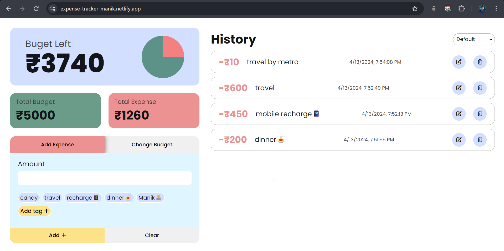
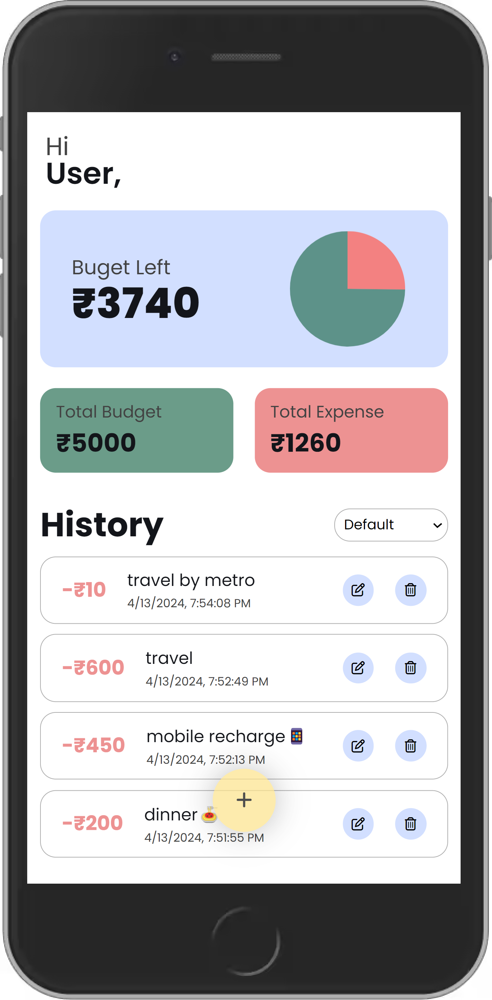

## Expense Tracker App 📊💰

📝 Manage your finances efficiently with this Expense Tracker App! Track your expenses, set budgets, and visualize your spending habits to stay on top of your financial goals. Built with HTML, CSS, JavaScript, and integrated with local storage for seamless user experience.

## Table of Contents

- [Preview](#preview)
- [Demo](#demo)
- [Features](#features)  <!-- Add Features Section -->
- [Technologies Used](#technologies-used)
- [Usage](#usage)
- [Acknowledgments](#acknowledgments)
- [Contact](#contact)

---

## Preview

### Desktop Preview

### Mobile Preview

---

## Demo

[Link to Live Demo](https://expense-tracker-manik.netlify.app/)

You can see the project in action by visiting the [live demo](https://expense-tracker-manik.netlify.app/).

---

## Features

Here are some key features of this app:

- 💼 Expense addition with customizable exp tags
- 💰 Budget input and budget editing 
- 📊 Local storage integration for budget, expenses, and tags
- 📜 Expense history display
- ✏️ Edit and delete functionalities for expense items
- 🔍 Expense history sorting options
- 📈 Budget left calculation and visualization via pie chart
- ❌ error handling
- 🖥️ Responsive design for seamless user experience

---

## Technologies Used

- HTML
- CSS
- JavaScript
- ChartJs

---

## Usage

### Installation
1. Clone the repository to your local machine using `git clone`.
2. Navigate to the project directory.

### Running the App
1. Go to `Expense-Tracker-App` folder by typing `cd Expense-Tracker-App` in terminal and type `live-server` in terminal to open Expense Tracker App in browser.

### Adding budget
- **Desktop:** Go to the "Change Budget" section and input your preferred budget amount in the designated field. Click on the "Add" button.
- **Mobile:** Tap on the plus (+) icon and input your budget amount in the provided field. Tap "Add".

### Adding Expenses
- To add expenses, go to the "Add Expense".
- Input the expense amount and select a expense tag. You can also create a custom tag by clicking on "Add tag" button.
- Clear all input fields by clicking on the "Clear" button.

### Viewing Expense History
- Go to `History` Scroll down to view your expense history.
- Sort the expense history by clicking on the dropdown to arrange transactions from high to low or low to high.

### Editing and Deleting Expenses
- In the expense history, each transaction is accompanied by edit and delete icons.
- Click on the edit icon to modify transaction details. A popup will appear where you can edit the amount, tag, or both. Click "Edit Expense" to save changes.
- To delete a transaction, click on the trash icon associated with the transaction and confirm.

### Mobile Screen
- The web app is designed to be responsive and mobile-friendly.
- You can toggle the "Add Expense" and "Change Budget" modal by tapping on the plus icon.

---

## Acknowledgments

This project wouldn't be possible without the following:

[Chart Js](https://www.chartjs.org/)

---

## Contact

- Manik Maity -[manikmaity010@gmail.com]
- [My LinkedIn](https://www.linkedin.com/in/manikmaity/)

